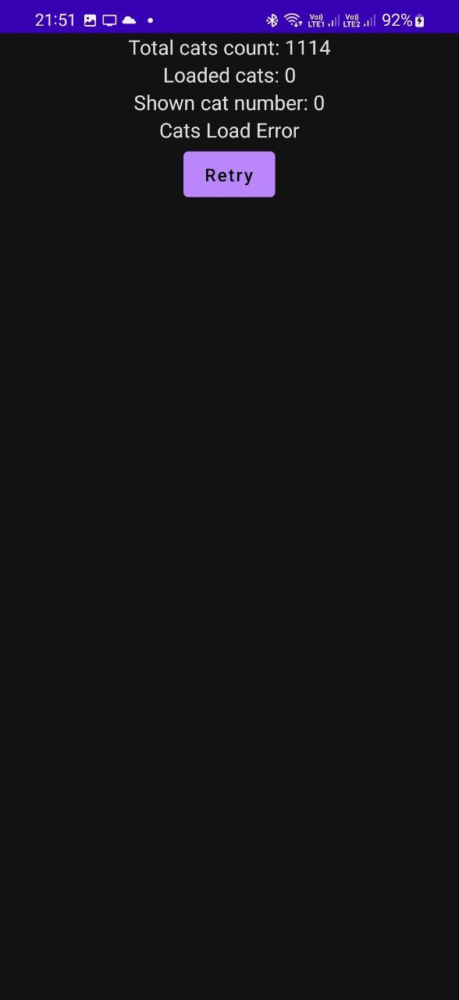

<h1 align="center">CatProject</h1>

<p align="center">
  <a href="https://android-arsenal.com/api?level=21"></a>
  <a href="https://github.com/LeFarmico"></a>
  <a href="https://www.linkedin.com/in/artsiom-zharnikovich-46726b1b5/"></a>

</p>

CatProject is a simple Test Application that uses [Cat as a service](https://cataas.com/#/) API to represent cats on the screen. You can check the work assignment to see all the tasks that have to be solved.

[Work assignment](documentation/Requirements.md)

## Download

Latest version: [Link to the app]()

## Tech stack

- [Kotlin](https://kotlinlang.org/) main language.
- [Coroutines/Flow](https://kotlinlang.org/docs/coroutines-overview.html) for asynchronous.
- Android Architecture Components.
  - MVVM Architecture (Model - View - ViewModel).
  - Repository Pattern.
  - View Binding.
- [Dagger Hilt](https://dagger.dev/hilt/) for dependency injection.
- [Jetpack Compose](https://developer.android.com/jetpack/compose) as view representation
- [Paging Compose](https://developer.android.com/jetpack/androidx/releases/paging) for pagination
- [Ktor](https://ktor.io/) for http requests
- Features:
  - LazyColumn
  - Pagination
  - StateFlow
  - [Gradle](https://gradle.org/) by using [Kotlin](https://kotlinlang.org/) language.  
  - Unit tests

## Architecture
The app is based on the MVVM architecture pattern and the Repository pattern, which is recommended by Google.

CatsProject by following the MVVM pattern consists of the three layers:

* UI Layer
* Presentation Layer
* Data Layer


### MVVM

The data flow consists of a few steps:

1. Initial state => ViewModel.
2. ViewModel shares to View by Flow.
3. View binds data and represents it in a view.
4. After an event happens in a View (such as a button click), View sends this event to ViewModel (calling a function).
5. ViewModel updates the current Model.
6. Updated Model returns to ViewModel (Flow updates the state).
7. And then we back to step 2.


## DataFlow

### DataModel

In this application were used two types of DataModel:

* ```CatMode```l represents network responses.
* ```CatViewDataModel``` represents repository returns (contains only the data that have to be shown)

### NetworkResponse

In cases of errors on the server side and exceptions on the client, NetworkResponse was used as a handler. Every http request has to be handled by ```NetworkResponse``` to prevent unexpected errors.

NetworkResponse is a sealed class that contains three states:

* ```NetworkResponse.Success(data)``` - in cases of successful requests.
* ```NetworkResponse.Exception(throwable)``` - in cases of an exception on the client side.
* ```NetworkResponse.Error(code, message, throwable)``` - in cases of an error on the server side

### DataState

```DataState``` It is used as the base representation of the screen such as Loading or Error.

DataState is a sealed class that contains three states:

* ```DataState.Loading``` - represents the Loading state of the screen.
* ```DataState.Error``` - represents the Error state of the screen. 
* ```DataState.Success``` - represents the Succes state that contains data

### DataFlow

* The DataFlow is designed to work independently from each other. Every DataFlow layer has no dependencies on each other.
* In this Application, the **Repository** doesn't handle ```NetworkResponse``` to ```DataState```. **ViewModel** does.

## UI

CatProject uses compose as a representation of View. ViewModel shares the ```DataState``` with the ```CatScreen``` composable function.

```CatScreen``` composable function uses DataState to show different views such as:

* Success
* Loading
* Error
* Internet connectivity state (doesn't depends on DataState)

<h1 align="center">UI | Error | LazyColumnError | NoInternet</h1>

<p align="center">




</p>

```
Copyright 2022 LeFarmico (Artsiom Zharnikovich)

Licensed under the Apache License, Version 2.0 (the "License");
you may not use this file except in compliance with the License.
You may obtain a copy of the License at

    http://www.apache.org/licenses/LICENSE-2.0

Unless required by applicable law or agreed to in writing, software
distributed under the License is distributed on an "AS IS" BASIS,
WITHOUT WARRANTIES OR CONDITIONS OF ANY KIND, either express or implied.
See the License for the specific language governing permissions and
limitations under the License.
```


